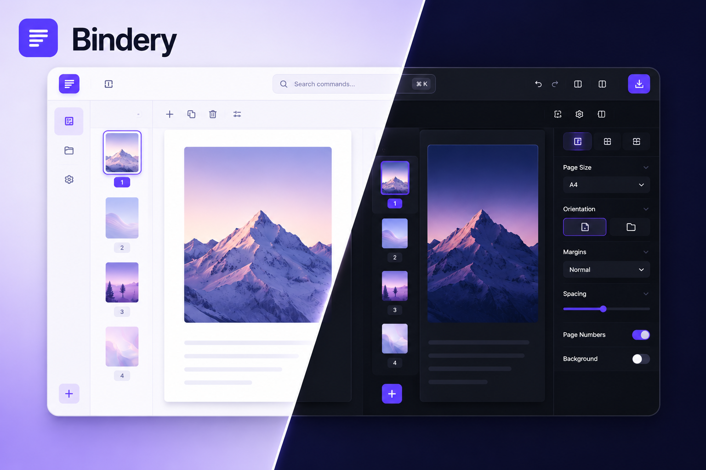

<div align="center">

# Bindery

### Turn a pile of photos and screenshots into a clean, exportable PDF.

**Local-first. Private. Built for the messy paperwork of everyday life.**

<br>

[](https://bindery.vercel.app)

<br>

[](#)
[](#license)
[](#tech-stack)
[](#tech-stack)

</div>

<br>

<p align="center">
  
</p>

<br>

## 📋 Contents

- [✨ Overview](#-overview)
- [🚀 Features](#-features)
- [🔒 Privacy](#-privacy)
- [🧱 Tech Stack](#-tech-stack)
- [🛠️ Getting Started](#️-getting-started)
- [📄 License](#-license)

<br>

## ✨ Overview

**Bindery** turns scattered photos, scans, screenshots, and documents into a single, polished PDF — entirely in your browser.

Drop your files in, arrange and clean up the pages, adjust how each image sits on the page, optionally pull out text with on-device OCR, and export one properly formatted document. Everything runs locally and stays on your device — an account is entirely optional, and only used to sync your settings across devices.

> 💡 Built for the pile of paperwork everyone has — forms, receipts, ID cards, handwritten notes, whiteboard photos, screenshots — all the things you need as _one document_, but only ever have as a folder of mismatched images.

<br>

## 🚀 Features

### 📥 Import & Organize

Drag-and-drop or browse to import — including PDFs, not just images. Every page of an imported PDF becomes a fully editable page, just like a photo: reorder by dragging, rotate, crop, duplicate, delete, or set a cover page — with Smart Scan flagging likely duplicate or blank pages along the way. The crop tool supports zooming and panning to fine-tune the selection, and can apply to a duplicate page instead of overwriting the original. Work in Grid, List, Single-page, or Continuous scroll view throughout.

### 🎛️ Per-Page & Project-Wide Control

Every page can be tuned independently — Image Fit (`Fit` / `Fill` / `Original` / `Stretch`) and margin — or you can bulk-apply a setting across the whole project. Choose a page size (`A4`, `Letter`, `A3`, or `Auto`, sized exactly to each image) and orientation, then zoom and pan in single-page view before you export.

### 🔎 On-Device OCR

Extract text in English, Hindi, or Marathi (or let it auto-detect), then select or copy it straight from the properties panel. Recognition happens in a Web Worker on your machine — nothing is sent anywhere.

### 💾 Built to Protect Your Work

Background autosave, session recovery if a tab closes unexpectedly, a history of recent projects with their own settings, and full undo/redo — including drag-reorders.

### ⚡ The Rest

Installable as a desktop or mobile PWA and works offline. A command palette (`⌘K`) and keyboard shortcuts for everything. Light, dark, or system theme. Update notifications when a new version ships.

### ☁️ Accounts & Settings Sync

Sign up or log in from the header to save your settings to your account and load them back on another device — entirely optional, and completely separate from your files. Your projects, pages, and exported PDFs never leave your browser; only your preferences (theme, import/export defaults, and so on) can sync, and only when you explicitly choose to.

<br>

## 🔒 Privacy

Bindery is local-first by design. Files, extracted text, projects, and generated PDFs all stay on your device — processed locally and stored via IndexedDB. **Your work is never uploaded, ever.**

An account is entirely optional. If you choose to sign up, the only things that ever reach a server are your login credentials and your app settings (theme, import/export defaults, and so on) — and only when you explicitly click save or load. There's no automatic or background sync, and no analytics or tracking of any kind.

<br>

## 🧱 Tech Stack

|                                              |                                |
| -------------------------------------------- | ------------------------------ |
| **Framework**                                | React 19 + TypeScript (strict) |
| **Build tool**                               | Vite                           |
| **Styling**                                  | Tailwind CSS v4                |
| **State**                                    | Zustand                        |
| **Local storage**                            | Dexie (IndexedDB)              |
| **PDF generation**                           | pdf-lib                        |
| **OCR**                                      | Tesseract.js, in a Web Worker  |
| **Drag & drop / sorting**                    | dnd-kit                        |
| **Motion**                                   | Framer Motion                  |
| **File import**                              | react-dropzone                 |
| **Backend** _(optional — account sync only)_ | Node.js, Express, MongoDB      |

<br>

## 🛠️ Getting Started

**Prerequisites:** Node.js, npm, and a MongoDB connection (a free
[Atlas](https://www.mongodb.com/atlas) cluster works fine)

```bash
git clone https://github.com/adnan-bhaldar/Bindery.git
cd Bindery
```

Bindery is split into two parts — a `client/` frontend and a `server/`
backend — each with its own dependencies and setup.

### Client

```bash
cd client
npm install
npm run dev
```

Open the local URL printed in your terminal and start dropping in images. 🎉

```bash
npm run build   # production build
npm run preview # preview the production build locally
npm run lint    # run ESLint
```

### Server

The backend stores account credentials and synced settings only — no
project or page data ever leaves your browser.

```bash
cd server
npm install
cp .env.example .env   # fill in MONGO_URI, JWT_SECRET, CLIENT_ORIGIN
npm run dev             # runs via nodemon
```

`npm start` runs the same server with plain `node` for production.

### Setup Notes (quick reference)

**`client/`**

- Env: create `.env` with `VITE_API_URL=http://localhost:5000` (base domain only, no `/api`)
- Install: `npm install` · Run: `npm run dev` · Build: `npm run build`

**`server/`**

- Env: copy `.env.example` → `.env`, fill in `MONGO_URI`, `JWT_SECRET`, `JWT_EXPIRES_IN`, `CLIENT_ORIGIN`
- Install: `npm install` · Run: `npm run dev` (nodemon) · Prod: `npm start`
- Needs a MongoDB connection (Atlas free tier works) — stores only account credentials and synced settings, nothing else

<br>

## 📄 License

GPL-3.0 — see [LICENSE](./LICENSE) for details.

<br>

<div align="center">

## Made with ❤️

<!-- by <a href="https://github.com/adnan-bhaldar"><strong>Adnan Bhaldar</strong></a> -->

</div>
